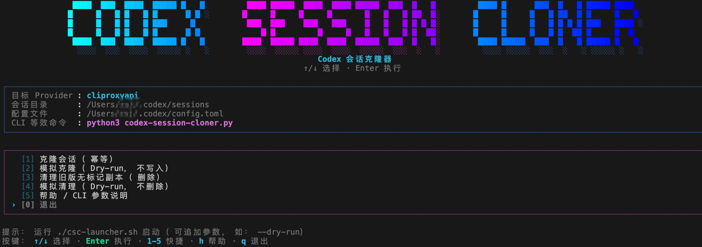

# Codex Session Cloner

一个 **安全、幂等、可回滚** 的工具，用于将现有 Codex 会话（sessions）**克隆**为当前配置的 `model_provider`，而不破坏原始数据。

适用于在 **切换 provider / 代理 / 模型后**，继续使用历史会话进行 `codex resume`。

---

## 功能特性

- ✅ **自动识别当前 provider**
  - 从 `~/.codex/config.toml` 读取 `model_provider`
- ✅ **幂等运行**
  - 已克隆的 session 不会重复克隆
- ✅ **安全克隆**
  - 原 session 永不修改，仅创建新文件
- ✅ **Dry-run 支持**
  - 预览所有操作，不写入、不删除
- ✅ **历史清理**
  - 可清理早期版本生成的「无标记 clone」

---

## 工作原理（简述）

1. 扫描 `~/.codex/sessions`
2. 建立已克隆 session 的索引（基于 `cloned_from` 字段）
3. 对 **非当前 provider** 的 session：
   - 生成新的 UUID
   - 修改 metadata 中的 `model_provider`
   - 记录来源信息
   - 写入新文件（保留原有时间戳顺序）
4. 可选：清理旧版本脚本生成、但未标记来源的 clone

---

## Clone 后的 Metadata 变更

新生成的 session **仅在 clone 时** 会额外包含以下字段：

~~~json
{
  "model_provider": "<current provider>",
  "cloned_from": "<original session id>",
  "original_provider": "<original provider>",
  "clone_timestamp": "2025-01-01T12:34:56.789"
}
~~~

### 用途说明

- 防止重复克隆
- 支持安全清理旧数据
- 保留 session 数据血缘关系

---

## 使用方法

### 默认（TUI 模式 / 推荐）



在交互式终端中 **不带参数运行** 会进入 TUI 菜单，更友好地选择：

- Clone（执行克隆）
- Dry-run（模拟）
- Clean（清理旧版无标记 clone）

TUI 操作：

- `↑/↓` 选择
- `Enter` 执行
- `1-5` 快捷选择
- `h` 查看帮助
- `q` 退出
- `Clean`（删除）在 TUI 中需要输入 `DELETE` 二次确认

#### Windows

- 双击 `快速启动.bat`
- 或在 PowerShell 中运行：`./csc-launcher.ps1`

#### Linux / macOS

```bash
chmod +x ./csc-launcher.sh
./csc-launcher.sh
```

也可以直接用 Python 运行：

```bash
python3 codex-session-cloner.py
```

如果希望在交互终端里 **跳过 TUI** 直接执行克隆：

```bash
python3 codex-session-cloner.py --no-tui
```

可选环境变量：

- `NO_COLOR=1` 关闭颜色输出
- `CSC_ASCII_UI=1` 强制 ASCII 边框（不支持 Unicode 时可用）
- `CSC_TUI_MAX_WIDTH=120` 限制 TUI 最大宽度（超宽终端可用）

> TUI 顶部的 Logo 会根据终端宽度自适配：优先显示一行 `CODEX SESSION CLONER` 字符画（宽终端更疏朗）；中等宽度会自动切换为更紧凑的字符画字体；过窄时会继续降级（最窄为 `CSC` 字符画 + 小字脚本名）。

启动脚本同样支持 **参数透传**（带参数时会直接走 CLI，不进菜单）：

- Windows：`./csc-launcher.ps1 --dry-run`
- Linux/macOS：`./csc-launcher.sh --clean --dry-run`

> 非交互环境（例如管道/CI）下无参数运行不会进入 TUI，会按原逻辑直接执行克隆。

---

### 普通运行（执行克隆 / CLI）

~~~bash
python3 codex-session-cloner.py
~~~

---

### Dry Run（强烈推荐首次使用 / CLI）

~~~bash
python3 codex-session-cloner.py --dry-run
~~~

仅显示将要执行的操作，不会创建或删除任何文件。

---

### 清理旧版未标记的 Clone（CLI）

用于清理 **早期版本脚本生成，但没有 `cloned_from` 字段** 的 session。

~~~bash
python3 codex-session-cloner.py --clean
~~~

同样支持 dry-run：

~~~bash
python3 codex-session-cloner.py --clean --dry-run
~~~

---

## 安全性说明

- ❗ 永远不会修改或覆盖原始 session
- ❗ 删除操作仅针对：
  - 当前 provider
  - 且无 `cloned_from` 标记
  - 且能通过时间戳明确关联原始 session
- ❗ 强烈建议首次运行使用 `--dry-run`

---

## 依赖

- Python ≥ 3.8
- 无第三方依赖（仅使用标准库）

---

## 非目标（刻意不做的事）

- 不修改对话内容
- 不尝试跨 provider 语义兼容
- 不自动删除原始 session
- 不解析或重写非 Codex 生成的文件
